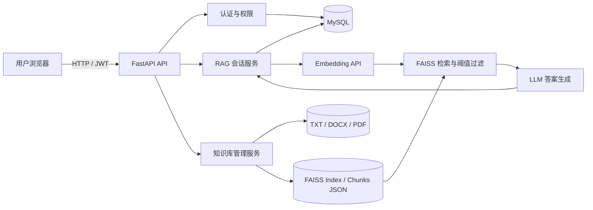

# 知晓库（Zhixiaoku）

一个基于 FastAPI、MySQL、FAISS 和 OpenAI 兼容 API 构建的 RAG 知识库问答应用。项目提供完整的用户认证、多会话问答、文档管理、向量检索、来源引用和响应式 Web 界面，可用于学习资料、项目文档和企业内部知识的检索问答。

> 当前版本定位为可部署的学习与作品展示项目，不是面向高并发生产环境的完整商业系统。
> 界面：


## 在线体验

- 在线演示：https://zhixiaoku-production.up.railway.app/ui/
- API 文档：https://zhixiaoku-production.up.railway.app/docs
- GitHub：https://github.com/635089875q-debug/zhixiaoku

> 在线服务使用 Railway 试用资源，若暂时无法访问，可按照下方说明在本地运行。目前只支持使用英文用户名注册。

## 项目亮点

- 支持 TXT、DOCX 和文本型 PDF 文档上传与解析
- 上传、覆盖或删除文档后自动重建 FAISS 索引并热加载
- 按自然段、换行和中英文标点进行文本分块，支持重叠窗口
- 结合绝对相似度阈值与相对分差过滤低相关片段
- 回答展示来源文件、片段编号、PDF 页码、相似度和原文内容
- 支持 RAG 多轮上下文、会话创建/删除及历史消息分页
- JWT 登录认证、密码 Argon2 哈希、普通用户与管理员权限隔离
- 用户只能访问自己的会话，知识库写操作仅允许管理员执行
- 知识库重建采用临时文件、备份恢复和互斥锁，降低索引损坏风险
- 前后端同源部署，提供响应式聊天界面和知识库管理侧边栏
- Docker 化运行，并通过 `DATA_PATH` 支持服务器持久化目录
- 已编写 API、认证、数据库、加载器、切分器、检索器和会话隔离测试

## 技术栈

| 分类 | 技术 |
| --- | --- |
| 后端 | Python 3.13、FastAPI、Pydantic、Uvicorn |
| AI | OpenAI Python SDK、SiliconFlow OpenAI 兼容 API |
| RAG | Embedding、FAISS、NumPy、自定义 Retriever |
| 数据库 | MySQL、PyMySQL |
| 认证 | JWT、Argon2（pwdlib） |
| 文档解析 | python-docx、pypdf |
| 前端 | HTML、CSS、JavaScript、Tailwind CSS |
| 测试与部署 | Pytest、Docker |

## 系统架构



## RAG 问答流程

1. FastAPI 验证 JWT，并确认会话属于当前用户。
2. 读取该会话最近的历史消息，将近期用户问题与本轮问题组成检索查询。
3. Embedding 模型把查询转换为向量。
4. FAISS 返回 Top-K 候选片段。
5. Retriever 使用相似度阈值 `0.55` 和相对分差 `0.04` 过滤结果。
6. 无有效片段时直接返回“知识库没有相关知识”，避免模型自由作答。
7. 有有效片段时，将参考资料和会话历史交给 LLM 生成答案。
8. 保存用户问题与 AI 回答，并返回可追溯的来源片段。

当前默认 Top-K 为 `3`，会话生成上下文最多读取最近 `10` 条消息，检索查询最多拼接最近 `3` 个用户问题。

## 知识库处理流程

```text
上传文档
  → 校验格式、文件大小与空内容
  → 解析 TXT / DOCX / PDF
  → 按段落和标点分块
  → 批量生成 Embedding
  → 写入临时 FAISS 索引和 chunks.json
  → 校验向量数与片段数
  → 原子替换正式索引
  → RAG Runtime 热加载
```

默认分块大小为 `400` 个字符，重叠长度为 `60` 个字符。PDF 按页提取和切分，来源信息中保留页码。

## 功能概览

### 用户与权限

- 用户注册、登录、退出和当前用户查询
- JWT Bearer Token 身份认证
- 用户密码仅保存 Argon2 哈希
- 普通用户可问答和管理自己的会话
- 管理员可上传、覆盖、删除文档及重建知识库

### 会话与问答

- 创建和删除 RAG 会话
- 多轮上下文问答
- 会话列表分页与历史消息分页
- 用户数据隔离和越权访问拦截
- 回答来源与检索分数展示

### 知识库管理

- 拖拽或选择 TXT、DOCX、PDF 文件上传
- 文档列表、关键词搜索和格式筛选
- 文档内容及分块预览
- 文档删除、覆盖和手动重建索引
- 文档数、片段数、向量数和检索参数统计
- 防止重复建库，并在失败时恢复原文件和索引

## 项目结构

```text
fastapi-study/
├── app/
│   ├── api/                 # FastAPI 路由：认证、聊天、RAG、知识库
│   ├── database/            # MySQL 连接和数据访问函数
│   ├── rag/                 # 文档解析、切分、Embedding、检索和生成
│   ├── schemas/             # Pydantic 请求与响应模型
│   ├── service/             # 认证、聊天、RAG 与知识库业务服务
│   ├── static/              # HTML、CSS、JavaScript 和品牌图片
│   ├── config.py            # 环境变量配置
│   ├── dependencies.py      # JWT 用户与管理员依赖
│   ├── paths.py             # 跨平台项目和数据路径
│   └── main.py              # FastAPI 应用入口
├── data/
│   ├── documents/           # 示例知识库文档
│   └── index/               # FAISS 索引与片段元数据
├── scripts/                 # 手动演示和离线建库脚本
├── sql/                     # 数据库初始化和迁移脚本
├── tests/                   # 自动化测试
├── Dockerfile
├── requirements.txt
└── pytest.ini
```

## 本地运行

### 1. 环境要求

- Python 3.13
- MySQL 8.x
- 可用的 SiliconFlow API Key

### 2. 创建虚拟环境并安装依赖

Windows PowerShell：

```powershell
python -m venv .venv
.\.venv\Scripts\Activate.ps1
python -m pip install -r requirements.txt
```

### 3. 初始化数据库

在 MySQL 中执行：

```text
sql/init.sql
```

已有旧版本数据库时，按编号顺序执行 `sql/migrations/` 中尚未运行的迁移脚本。

### 4. 配置环境变量

复制示例文件：

```powershell
Copy-Item .env.example .env
```

填写 `.env`：

```env
SILICONFLOW_API_KEY=your_api_key
BASE_URL=https://api.siliconflow.cn/v1
LLM_MODEL=your_llm_model
EMBEDDING_MODEL=your_embedding_model
SYSTEM_NAME=小库

MYSQL_HOST=localhost
MYSQL_PORT=3306
MYSQL_USER=root
MYSQL_PASSWORD=your_mysql_password
MYSQL_AI_DATABASE=ai_chat

JWT_SECRET_KEY=replace_with_a_random_secret_at_least_32_bytes
JWT_ALGORITHM=HS256
JWT_EXPIRE_MINUTES=120
```

`.env` 已被 Git 忽略，请勿将真实 API Key、数据库密码或 JWT 密钥提交到仓库。

### 5. 启动服务

```powershell
uvicorn app.main:app --reload
```

访问地址：

- Web 页面：<http://127.0.0.1:8000/ui/>
- Swagger API 文档：<http://127.0.0.1:8000/docs>

## Docker 运行

构建镜像：

```powershell
docker build -t zhixiaoku .
```

如果 MySQL 运行在 Windows 宿主机：

```powershell
docker run --name zhixiaoku-app `
  --env-file .env `
  -e MYSQL_HOST=host.docker.internal `
  -p 8000:8000 `
  zhixiaoku
```

容器内默认数据目录是 `/app/data`。部署到服务器时，应将该目录挂载为持久化磁盘，否则运行期间上传的文档和重新生成的索引会在容器被替换后丢失。

## 自动化测试

运行全部测试：

```powershell
pytest -v
```

当前测试覆盖：

- 文档加载与异常 PDF
- 文本分块与 PDF 页码保留
- 相似度阈值、相对分差和无效向量编号处理
- 用户注册、登录、密码哈希与 JWT
- API 鉴权和管理员权限
- 会话归属校验、用户数据隔离和上下文传递
- 会话及历史消息分页
- 文档上传、查看、删除和知识库重建

当前回归结果：`78 passed`。

## 主要 API

| 方法 | 路径 | 说明 |
| --- | --- | --- |
| POST | `/auth/register` | 用户注册 |
| POST | `/auth/login` | 用户登录并签发 JWT |
| GET | `/auth/me` | 查询当前用户 |
| POST | `/rag/chat` | RAG 问答 |
| POST | `/rag/conversations` | 创建会话 |
| GET | `/rag/conversations` | 分页查询会话 |
| DELETE | `/rag/conversations/{id}` | 删除自己的会话 |
| GET | `/rag/conversations/{id}/messages` | 分页查询会话消息 |
| GET | `/knowledge/documents` | 查询知识库文档 |
| GET | `/knowledge/documents/{filename}` | 查看文档和分块 |
| POST | `/knowledge/upload-file` | 管理员上传文档 |
| DELETE | `/knowledge/documents/{filename}` | 管理员删除文档 |
| POST | `/knowledge/rebuild` | 管理员重新建库 |
| GET | `/knowledge/stats` | 查询知识库运行状态 |

完整请求参数和响应结构请在启动后访问 `/docs` 查看。

## 当前限制

- PDF 仅支持提取文本层，不支持扫描件 OCR。
- FAISS 索引和上传文档存储在本地文件系统，服务器部署需要持久化磁盘。
- 知识库重建在 Web 进程中同步执行，更大规模文档应改为后台任务队列。
- 当前使用单机 FAISS，尚未支持多实例共享向量库和横向扩容。
- 尚未实现邮箱/手机验证码、密码找回和第三方登录。
- 面向公开生产环境时，还需要补充 HTTPS、请求限流、审计日志、监控和备份策略。

## 后续计划

- 为 Railway 部署配置持久化数据卷，保存用户上传的文档与动态生成的 FAISS 索引
- 增加流式回答与生成中断
- 增加 OCR 和更多文档格式
- 引入异步建库任务及任务进度查询
- 增加 RAG 评测集和召回/回答质量指标
- 完善日志、限流、监控和异常追踪

## 安全说明

- 仓库不包含真实 `.env`，所有密钥通过环境变量注入。
- 密码使用 Argon2 哈希，不保存明文密码。
- 会话查询和删除均校验当前用户归属。
- 知识库修改接口要求管理员权限。
- 示例文档只用于演示 RAG 流程，不包含真实业务数据。

## License

本项目目前用于个人学习和求职作品展示。正式开源许可将在后续版本中补充。
